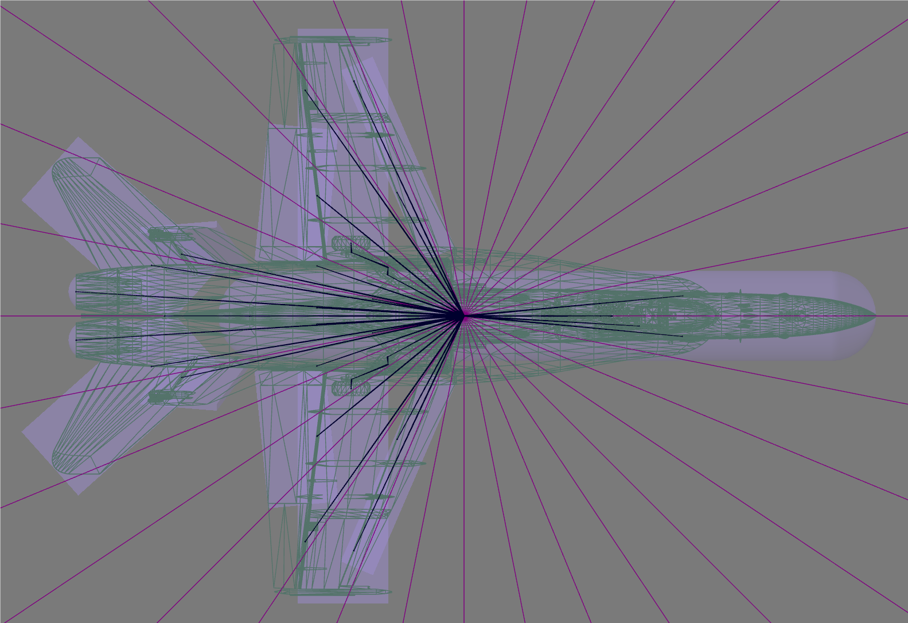

# Phisical Jet project

This is a samll physical playground with some of my experiments. Currently there are is a physical jet and some other veihicles. In the future I may add more fun stuff here(or in other repos). 

# Demo
[Demo1](https://www.youtube.com/watch?v=2m4XY6OuuPE)

(If gifs are not shown please wait or go to [Gifs](Demo) to watch them.)
# Features
## Totally Phisically Simulated
  
Calculating all related forces, including Lift, drag, gravity, thrust, pressure-induced changes in lift, stall angle, etc.

## Stalling
  
The physical airflow system enables an airplane to perform authentic maneuvers, including stalling.

## Explosion & multiplayer
  
The jet is both breakable and destructible, with all actions synchronized across all other clients. (Physics networked)

## Dynamic breaking
  
The jet can sustain damage from collisions or gunfire while in flight, leading to dynamically altered airflow and variations in control simulation results.

## Physics Asset
  
The configuration of physics assets will realistically alter the center of mass and affect the sensation of flight control.

# Thank you!
